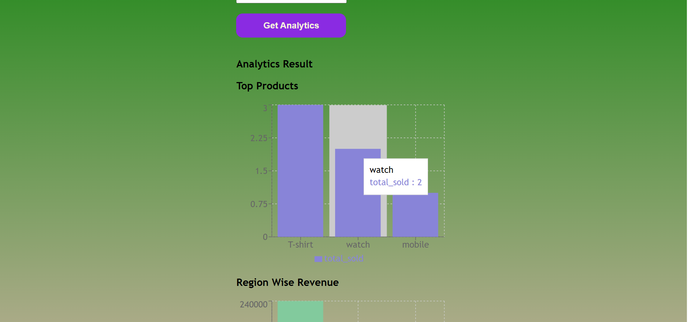

Hi, I have done this Sales analytics dashboard, 
by using backend Nodejs,Sql,ExpressJs

for conection string for stroing persistance data i have used a postgreSql 
faced so many issues and addresing those issues finally solved 
understanding those top products,top customers,region wise stats 
and implemented those things 

frontend i have used a React and css 
initially testing purpose i have used a postman and TablePlus 

added those feature like filtering based on start date and end date 
and added download sales reports 
total orders and total revenue 
average order value 

frontend i have used a netlify deployement 
backend i have used a render platform 

if you want to test on your machine you can do backend clone my git repo 
git clone (my repository url)
npm install 
node server.js 

those commands with add a .env file with PORT number and DATABASE_URL 
if you have a connection string if you had please paste over there DATABASE_URL 

on frontend repo 
git clone (my frontend repo url) 
cd analytics-frontend 
npm install 

while testing api in components you need to change the api to your local host url 
like "http://localhost:5000" 

below are the some of the screen shots provided 

Thank you for watching !

if you had any doubts feel free to msg me in daveeddaveedd@gmail.com 
